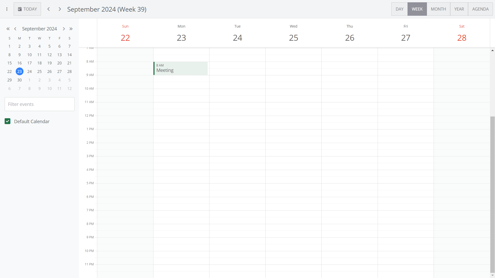

# How to connect and sync Bryntum Calendar to Microsoft Planner

The code for the complete app is on the `completed-calendar` branch.

## Getting started

The starter repository uses [Vite](https://vitejs.dev/), which is a development server and JavaScript bundler. You’ll need Node.js version 18+ for Vite to work. 
Install the Vite dev dependency by running the following command: 

```sh
npm install
```

Install the Bryntum Calendar component by following [step 1](https://bryntum.com/products/calendar/docs/guide/Calendar/quick-start/javascript-npm#access-to-npm-registry) and [step 4](https://bryntum.com/products/calendar/docs/guide/Calendar/quick-start/javascript-npm#install-component) of the [vanilla JavaScript with npm setup guide](https://bryntum.com/products/calendar/docs/guide/Calendar/quick-start/javascript-npm).

## Running the app

Run the local dev server using the following command:

```sh
npm run dev
```

You'll see a Bryntum Calendar with a single event:

